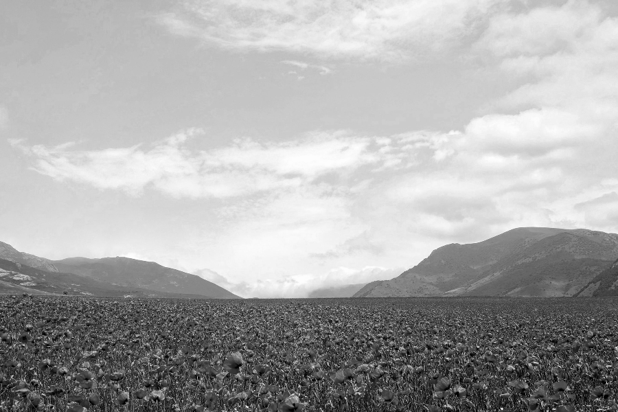

# Digital-Image-Processing
## Discription
HW1: Image Enhancement + Noise Removal  
HW2: Edge Detection + : Geometrical Modification  
HW3: Morphological Processing + Textutre Analysis  
HW4: Digital Halftoning + Image Sampling  
Final Project: Visual Cryptography, see my another repository [HVC-VAC](https://github.com/woody8657/HVC-VAC_Authentication)  

